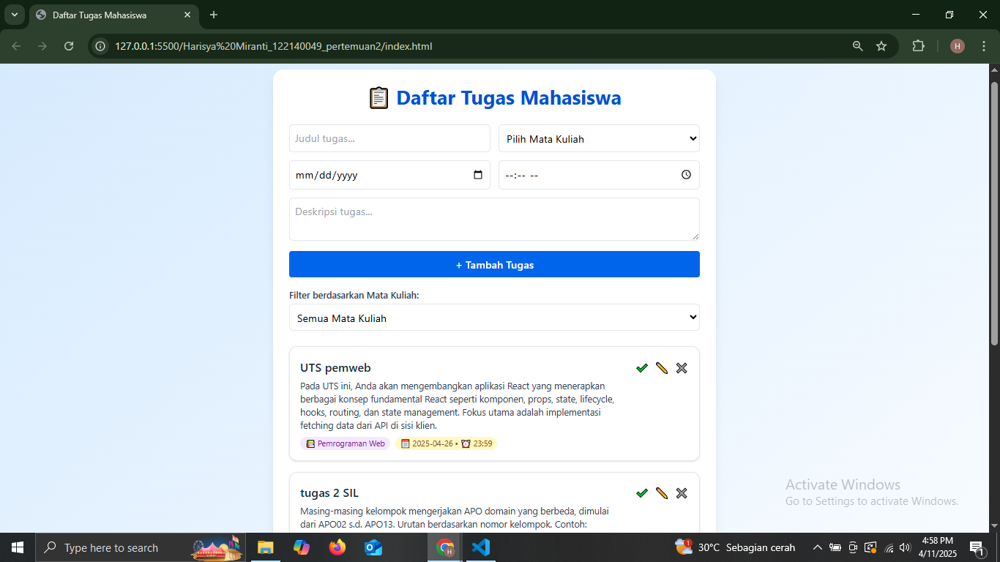

Aplikasi Daftar Tugas Mahasiswa

Aplikasi ini merupakan proyek praktikum "Pemrograman Web Next Gen" pada pertemuan 2 yang berfungsi sebagai dashboard untuk mencatat, mengelola, dan menyaring tugas-tugas perkuliahan mahasiswa berdasarkan mata kuliah, deadline, dan status penyelesaian.
Aplikasi ini dibuat menggunakan HTML, CSS (dengan TailwindCSS), dan JavaScript (ES6+), serta menyimpan data secara lokal di browser menggunakan localStorage.

Fitur Aplikasi

✅ Tambah tugas lengkap dengan:
- Judul tugas
- Mata kuliah (dropdown)
- Tanggal deadline
- Jam pengumpulan
- Deskripsi tugas

✅ Tandai tugas sebagai selesai / belum selesai

✅ Edit judul tugas

✅ Hapus tugas

✅ Filter berdasarkan mata kuliah

✅ Penyimpanan data otomatis di localStorage

✅ Tampilan responsif dan rapi menggunakan TailwindCSS

Fitur ES6+ yang Diimplementasikan

1. let & const
--> Semua deklarasi variabel menggunakan let atau const secara tepat

2. Arrow Function
--> Digunakan untuk event handler, filter, forEach, dan utility function

3. Template Literals
--> Digunakan untuk rendering HTML tugas secara dinamis

4. Classes
--> class Task dan class TaskManager digunakan untuk manajemen data tugas

5. Async/Await
--> Fungsi simulateFetchTasks() menggunakan async/await dan Promise
