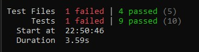

# MyBooks

Aplikasi **MyBooks** adalah aplikasi web sederhana untuk mencatat dan mengelola koleksi buku pribadi Anda. Pengguna dapat:

- Menambah, mengedit, dan menghapus buku (judul, penulis, status: milik / sedang dibaca / ingin dibeli)  
- Memfilter daftar berdasarkan status  
- Mencari buku berdasarkan judul atau penulis  
- Melihat statistik jumlah buku per status  
- Data disimpan otomatis di `localStorage` sehingga tidak hilang saat refresh  

---

##  Instalasi & Menjalankan

1. **Clone repository**  
   ```bash
   git clone [url repo]
   cd personal-book-manager
   ```

2. **Install dependencies**  
   ```bash
   npm install
   ```

3. **Jalankan development server**  
   ```bash
   npm run dev
   ```  
   Buka di browser: `http://localhost:5173`

4. **Menjalankan unit test (Vitest)**  
   ```bash
   npm run test
   ```

---

##  Screenshot Antarmuka

<details>
<summary> Home & Form</summary>

  
*Menambah buku baru, mencari & memfilter daftar.*
</details>

<details>
<summary> Statistik</summary>

  
*Halaman Statistik jumlah buku per status.*
</details>

---

##  Fitur React yang Digunakan

- **Functional Components & JSX**  
  Semua komponen dibuat sebagai fungsi, dengan JSX untuk mendefinisikan UI.

- **Hooks**  
  - `useState` untuk mengelola state lokal (form input, filter, search).  
  - `useEffect` untuk side‑effect (sinkronisasi state ke `localStorage`).  
  - **Custom Hook** `useLocalStorage` untuk enkapsulasi logika penyimpanan di browser.  
  - **Custom Hook** `useBookStats` untuk menghitung statistik buku menggunakan `useMemo`.

- **Context API**  
  - `BookContext` & `useBooks()` untuk state global daftar buku dan dispatch actions (`ADD`, `UPDATE`, `DELETE`).
  - Menghindari prop‑drilling dan memudahkan akses state di berbagai komponen.

- **React Router (v6)**  
  - Routing SPA:  
    - `/` → Halaman Home (daftar & form)  
    - `/stats` → Halaman Statistik  

---

##  Screenshots Hasil Test

  


